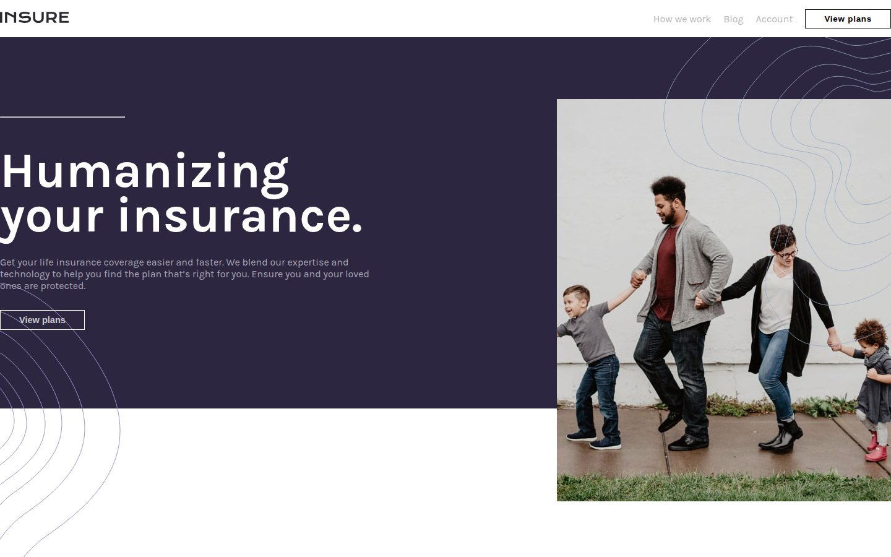
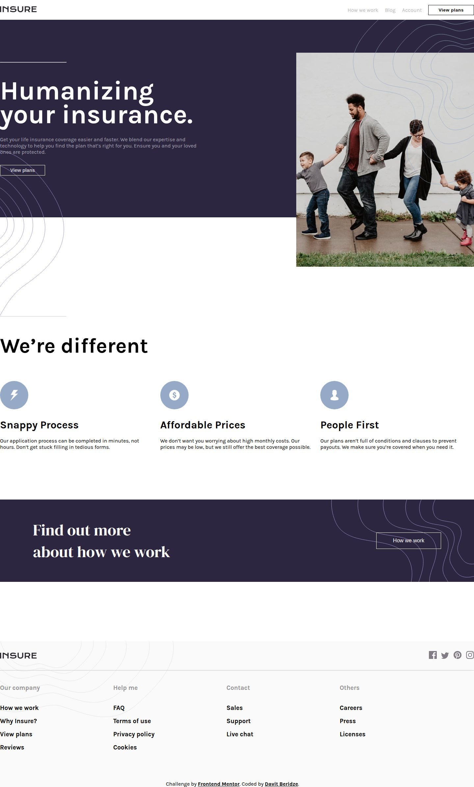
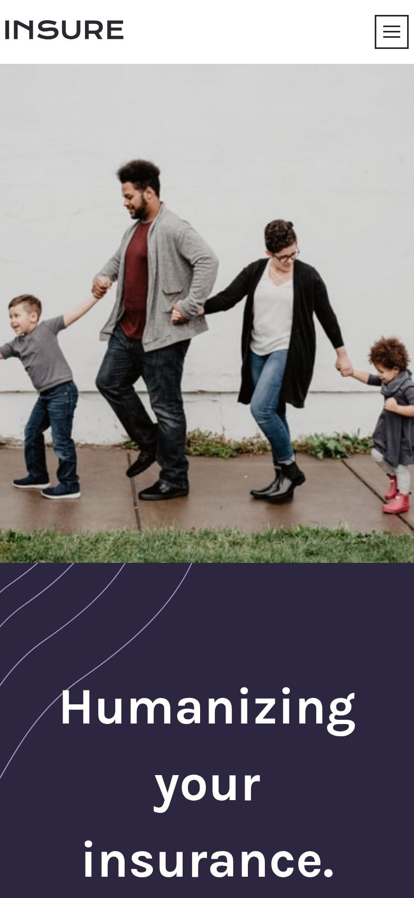

# Insure Landing Page

My solution to the [Insure landing page](https://www.frontendmentor.io/challenges/insure-landing-page-uTU68JV8) challenge on Frontend Mentor. A marketing landing page for a fictional insurance company.

Live site: [insure-landing-page-ma.netlify.app](https://insure-landing-page-ma.netlify.app/)



| Full page | Mobile |
| --- | --- |
|  |  |

## Features

- Hero section, feature highlights, call-to-action banner, and footer
- Hamburger menu on mobile that swaps the page content for the navigation
- Separate desktop and mobile layouts

## Built with

- Semantic HTML
- CSS with Flexbox, media queries, and transitions
- Vanilla JavaScript for the mobile menu

## Run locally

No build step or dependencies. Open `index.html` in a browser, or serve the folder:

```bash
npx serve .
```
